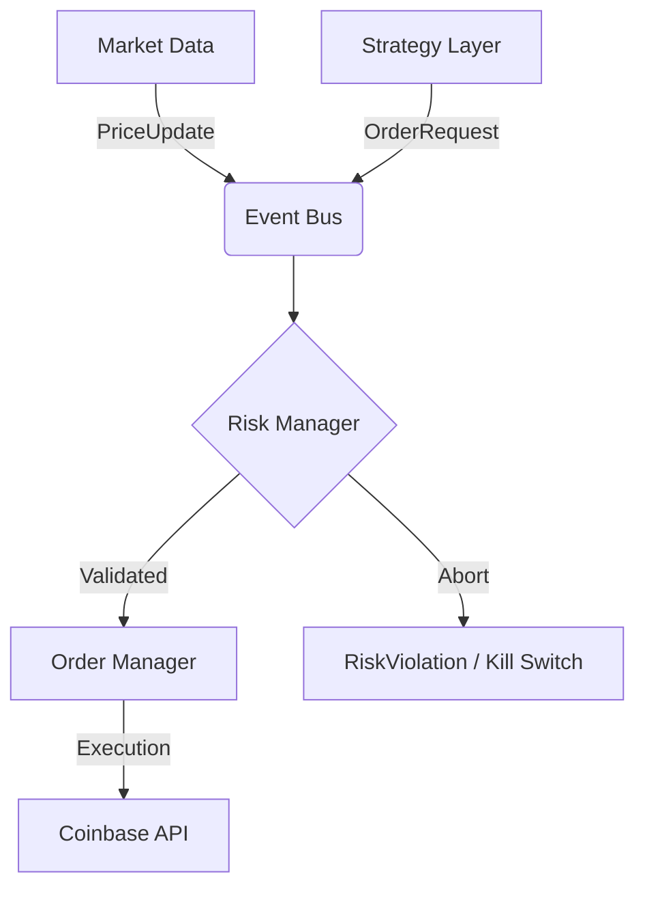

# [Coinbase Trading Bot]

### Production-Grade Infrastructure for Agentic Quantitative Trading

**Coinbase Trading Bot** is an asynchronous, event-driven framework designed to bridge the gap between Large Language Model (LLM) reasoning and professional market execution. It provides a hardened infrastructure—Websocket management, order lifecycle persistence, and multi-stage risk validation—allowing developers to focus entirely on the strategy layer.

**[Technical Specs](https://www.google.com/search?q=%23architecture)** • **[Risk Pipeline](https://www.google.com/search?q=%23risk-management)** • **[Intelligence Layer](https://www.google.com/search?q=%23intelligence-layer)** • **[Quick Start](https://www.google.com/search?q=%23quick-start)**

---

## System Architecture

The framework is built on an **Async Event Bus** architecture. All components are decoupled nodes that communicate via typed, immutable events, ensuring non-blocking execution and high throughput.



### Core Components

| Component | Responsibility |
| --- | --- |
| **Market Data** | Real-time Coinbase WebSocket (Ticker Channel) persistence. |
| **Order Manager** | Full lifecycle tracking with fee accounting and 5-stage fill verification. |
| **Position Tracker** | Real-time realized P&L and daily summaries via SQLite. |
| **Strategy Select** | Dynamic switching between `PriceOnly` and `News-Aware` (Grok + Claude) modes. |

---

## Intelligence Layer

The system treats trading as a multi-modal cognitive process rather than a set of rigid indicators:

* **Claude Opus 4.6 Integration:** Performs high-context price target forecasting using structured JSON outputs.
* **Grok xAI News Service:** Ingests real-time crypto news and sentiment to inform high-conviction trades.
* **Vectorized History:** Maintains an in-memory `PriceBuffer` for technical analysis snapshots.

---

## Risk Management & Transparency

In quantitative trading, defense is the only way to survive. This system implements a **three-stage validation pipeline** that functions as a persistent circuit breaker:

1. **Kill Switch:** An emergency halt that persists across system restarts via SQLite.
2. **Order Guardrails:** Strict `MAX_ORDER_SIZE_USD` limits per transaction.
3. **Daily Drawdown Protection:** Automatic halt if cumulative losses exceed `MAX_DAILY_LOSS_USD`.

### The Dashboard

A sophisticated bot shouldn't be a black box. The included **Next.js Dashboard** provides institutional-level visibility:

* **Equity Curves:** Real-time portfolio performance and drawdown stats.
* **Prediction Logs:** Expandable logs showing the specific news headlines and reasoning used by the AI for every trade.
* **Execution History:** Full order logs with actual fill prices and exchange fees.

---

## Developer Setup

### Prerequisites

* Python 3.12+
* Coinbase CDP API Keys
* Anthropic/xAI API Keys (Optional for AI strategies)

### Quick Start

```bash
# Clone and install in editable mode
git clone <repo-url> coinbase_trading_bot
cd coinbase_trading_bot
python -m venv .venv
source .venv/bin/activate
pip install -e ".[dev]"

# Configure environment
cp .env.example .env

# Verify plumbing with the Interactive Smoke Test
python scripts/smoke_test.py

```

### Reliability Testing

The project maintains a rigorous test suite with 80+ unit and integration tests using mocked Coinbase responses.

```bash
pytest --cov=src

```

---

## Disclaimers

**For Research and Educational Purposes Only.**
Digital asset trading involves significant risk. This software is provided "as-is" without warranties. Always validate your strategies via the `smoke_test.py` script and paper trading before deploying capital.

